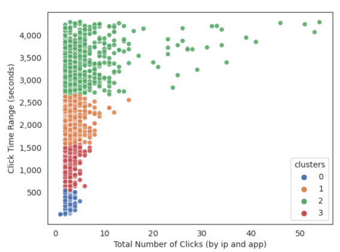

## Data Mining Techniques for Detection of Advertising Click Fraud
Advertising click fraud is the act of clicking on digital ad links to obtain fraudulent revenue.  The people committing click fraud exploit the PPC (Pay per Click) revenue model.  The PPC revenue model requires the advertisers to pay ad exchanges for each ad that's clicked on. The ad exchange receives payments from advertisers and pays a portion of its revenue to the publisher websites that host ads for the advertisers.

`Ad Exchange Network`

Click fraud occurs through crowdsourcing, click farms, and botnets. Crowdsourcing is done by publisher websites that make false appeals for help or false promises of rewards to redirect large numbers of people to click on ads. Click farms employ humans to click on ads repeatedly to make illegitimate revenue. Botnets are malicious networks of computers that are directed from a command center to click on ads to gain fraudulent revenue.

`Botnet Network`

## TalkingData Data Set
The TalkingData data is provided by TalkingData Inc.  TalkingData Inc. hosted a competition on Kaggle to further its understanding for detecting click fraud.  The TalkingData data set has over 184 million records. 

| Attribute     | Description                                                                          |
|---------------|--------------------------------------------------------------------------------------|
| ip            | IP address of click (IP represents user who clicked on ad)                           |
| app           | App id for marketing department                                                      |
| device        | Device type id                                                                       |
| os            | Operating system of mobile device                                                    |
| channel       | Publisher channel hosting the ad                                                     |
| click_time    | Timestamp of the click                                                               |
| is_attributed | Target variable.  1 indicates app was downloaded; 0 indicates app was not downloaded |

## Data Extraction
An ETL (Extract, Transform and Load) process loads the raw data file into a Google Cloud Storage bucket.  The data is then processed by PySpark jobs to create a stratified sample of the data set.  The sample data is loaded into a Google BigQuery database table.

## Preprocessing
The app, channel, device, and os variables are categorical identifiers for the mobile device that initiated the click.  These categorical variables are converted into numeric predictors by calculating an encoded value for each variable.  The new app_encoded, channel_encoded, device_encoded, and os_encoded variables have values between zero and one.

[Data Pre-Processing Notebook](https://github.com/mwalbers1/DSC-680-Summer-2023/blob/main/Data%20Preprocess.ipynb)

## Cluster Analysis
A K-Means clustering analysis was implemented with four initial clusters. Cluster 0 represents "one-time" clicks. Over 90% of Cluster 0 clicks occurred on only one app by a user.  Cluster 2 represents outliers in the data set.  There are a few instances of a user who clicked on the same app ad over fifty times.

[K-Means Clustering Notebook](https://github.com/mwalbers1/DSC-680-Summer-2023/blob/main/KMeans%20Clustering.ipynb)

## Classification Models
The K-Nearest Neighbors, Decision Tree, and Random Forest models each classifies ad clicks that results in an app download or not downloaded.  Each model algorithm has the following steps.

1. Initialize training and test sets
2. Feature selection 
2.1 Select five best features with wrapper method 
2.2 Scale features (if necessary) 
3. Build model 
3.1 Apply grid search cross-validation (GridSearchCV) for parameter tuning 
3.2 Train model with stratified K-folds cross-validation 
3.3 Re-train model on the entire training set 
4. Evaluate the model on the test set 
4.1 Create confusion matrix 
4.2 Calculate number of TP, FP, TN, FN 
4.3 Calculate accuracy, precision, recall, and f1-score 

 

[K-Nearest Neighbors Model](https://github.com/mwalbers1/DSC-680-Summer-2023/blob/main/K-Nearest%20Neighbors%20Model.ipynb)

[Decision Tree Model](https://github.com/mwalbers1/DSC-680-Summer-2023/blob/main/Decision%20Tree%20Model.ipynb)

[Random Forest Model](https://github.com/mwalbers1/DSC-680-Summer-2023/blob/main/Random%20Forest%20Model.ipynb)

## Final Presentation
<a href="https://github.com/mwalbers1/DSC-680-Summer-2023/blob/main/Michael_Albers_Capstone_Presentation.pdf" target="_blank">Capstone Presentation</a>
